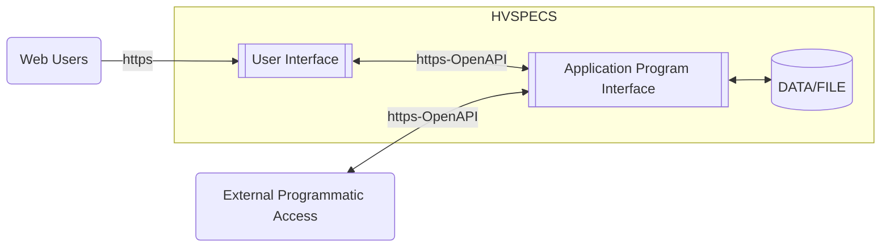
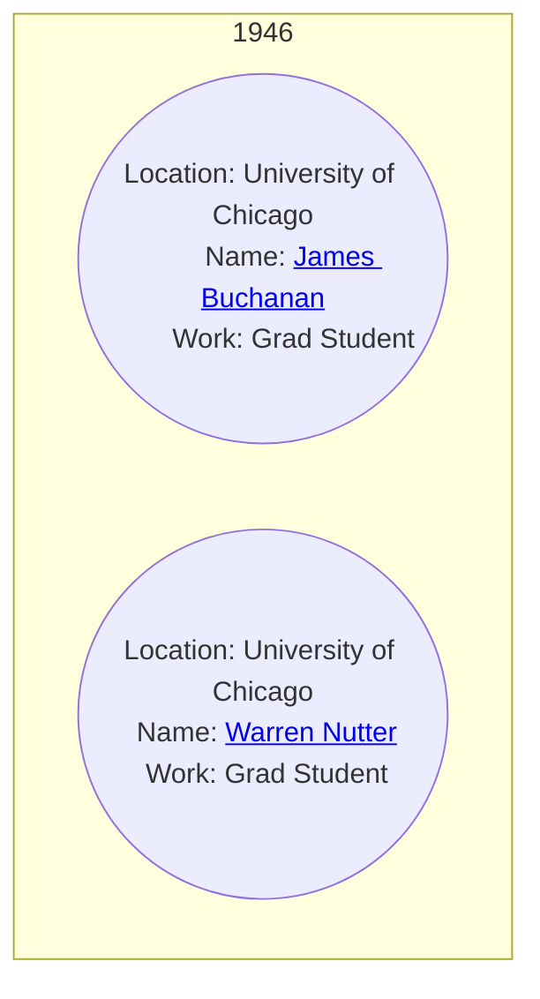
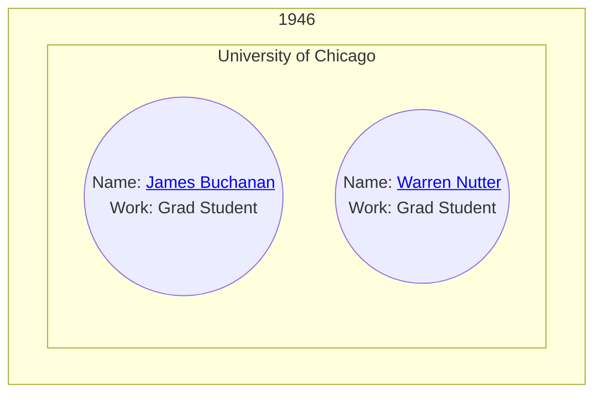
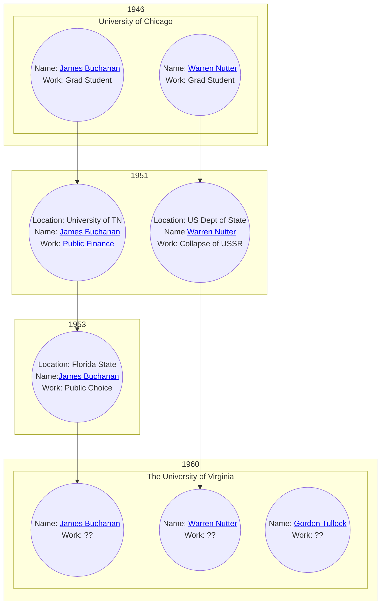

# History of Virginia School of Political Economy Collaboration System
## Functional Specifications

---

### Introduction

HVSPECS is a definitive system of record and research collaboration tool for the History of the [Virginia School of Political Economy](https://en.wikipedia.org/wiki/Virginia_school_of_political_economy).

**Purpose**

Development of a collaborative online platform within which an extensive and continually growing team of authors can work together to document, categorize, and publish the thousands of articles, past, present, and future, which make up the historical output of the Virginia School. 

**Scope**
This system will provide mechanisms for the following:
- Uploading, categorizing, indexing, and searching for articles and publications relating to the Virginia School of Political Economy.  
- Managing contributing authors/users and associated credentials
- Managing user roles
- Managing a document approval chain for submitted articles
- Managing a user notification system for document chain and collaboration
- File/Blob storage for uploaded documents and media
- Database of articles organized by subject date range, subject location, and subject personal identity
- Dynamic visual representation of historical timeline
- Search engine for researching the history of the Virginia School of Economy.

Project will follow a standard layered architecture.  UI | API | Data/File:

- Web users will authenticate via basic auth
- API authentication will be done with system issued bearer tokens unless cloud OAuth is available
- File/Blob storage will be used for storing original uploaded articles and media files
- Database storage will likely be a document store such as MongoDB

**Dynamic visual representation of historical timeline**

The dynamic visual representation will be based on a data structure called a bubble.  Each bubble will have the following structure:
Bubbles
- Date Range
- Geographical Location/ Institution
- Principle Subject Author
- Significant Achievement/Work

Bubble behavior:
- organized along a vertical time axis
- generated dynamically based on search criteria
- will collapse (effervesce) into larger bubbles when bubble data intersects

Bubble Examples

The above bubbles should collapse to:

Example with longer timeline:

** please note:
These diagrams were created with [mermaid](https://mermaid.js.org/) as examples and do not fully represent the desired final presentation of the bubble data.

[Original Specification](images/original_spec.jpg)
