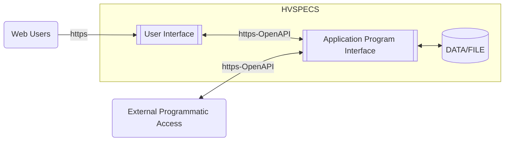
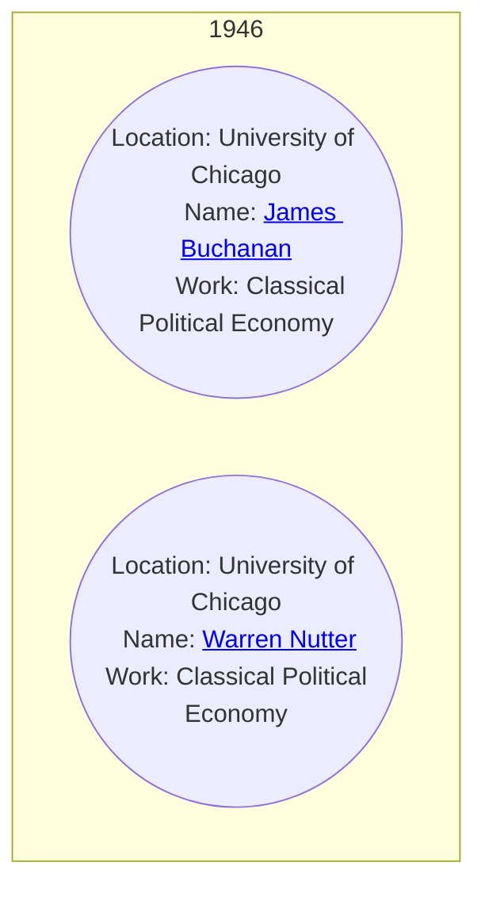
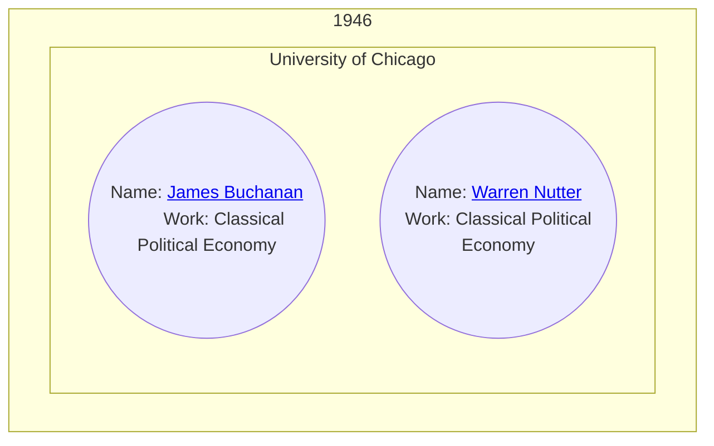
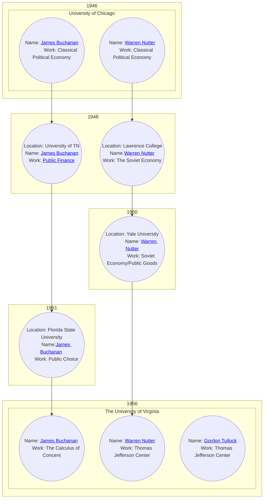

# History of Virginia School of Political Economy Collaboration System
## Functional Specifications

---

### Introduction

HVSPECS is a definitive system of record and research collaboration tool for the History of the [Virginia School of Political Economy](https://en.wikipedia.org/wiki/Virginia_school_of_political_economy).

## The History of The Virginia School of Political Economy

Nobel Laureate James Buchanan, G. Warren Nutter, and Gordon Tullock developed the Virginia School of Political Economy through their academic entrepreneurship at several institutions which sometimes proved to be hostile environments for Buchanan’s Nobel ideas.  The History of The Virginia School of Political Economy project traces out many of those ideas through their academic entrepreneurship at The University of Virginia, UCLA, Virginia Tech, George Mason University, and beyond. More importantly, the project provides a historical context to their careers including their setbacks, their responses to those setbacks, and the intellectual context of their academic entrepreneurship.

The project began in 1948 at The University of Chicago where graduate students James Buchanan and G. Warren Nutter shared a sense of frustration with the growing loss of the grand tradition of classical political economy as represented by Adam Smith. Upon graduation, Buchanan held brief appointments at The University of Tennessee and Florida State University while Nutter lectured at  Lawrence and Yale.

In 1956, Buchanan and Nutter reunited as faculty at the University of Virginia and  decided to establish a unique academic entrepreneurial venture. With the support of Dean William Duren and Colgate Darden, president of UVA, Buchanan and Nutter established the Thomas Jefferson Center for Studies in Political Economy and Social Philosophy. They gathered other prominent scholars Gordon Tullock, Ronald Coase, George Steigler, Lealand Yeager, and Alexander Kafka, within the Jefferson Center to begin what was to become known as the Virginia School of Political Economy. In a university newsletter describing the founding of that center, Buchanan explained  that political economists must go farther than technical economic principles to the philosophical issues that necessarily underlie the appropriate functions of government and all proposed economic policy.
Buchanan and Nutter were compelled to act entrepreneurially in the field of higher education because of the emerging post–World War II hegemony of Keynesian Economics and the idea that economics was a form of social engineering, in which economists could offer technical advice to benevolent decision makers in order to steer the economy in the right direction.  Buchanan stated publicly “We sensed that technique was replacing substance”,

The History of The Virginia School of Political Economy project traces out how James Buchanan, Warren Nutter, Gordon Tullock, and the Virginia School of Political Economy were successful despite operating in methodologically and ideologically hostile environments. In doing so, it provides both an intellectual and an institutional history of the Virginia School, and contributes to a growing literature dealing with Buchanan, Nutter, and Tullock’s academic entrepreneurship in developing what has become known in the Economics research literature as a “creative community,” a “liberal political economy,” and an “economics of natural equals”

The project traces the history of The Virginia School through the people, places, institutions, ideas, and politics of the times through which it grew to international recognition and continues to develop today.  

**Purpose**

Development of a collaborative online platform within which an extensive and continually growing team of authors can work together to document, categorize, and publish the thousands of articles, past, present, and future, which make up the historical output of the Virginia School. 

**Scope**
This system will provide mechanisms for the following:
- Uploading, categorizing, indexing, and searching for articles and publications relating to the Virginia School of Political Economy.  
- Managing contributing authors/users and associated credentials
- Managing user roles
- Managing a document approval chain for submitted articles
- Managing a user notification system for document chain and collaboration
- File/Blob storage for uploaded documents and media
- Database of articles organized by subject date range, subject location, and subject personal identity
- Dynamic visual representation of historical timeline
- Search engine for researching the history of the Virginia School of Economy.

Project will follow a standard layered architecture.  UI | API | Data/File:

- Web users will authenticate via basic auth
- API authentication will be done with system issued bearer tokens unless cloud OAuth is available
- File/Blob storage will be used for storing original uploaded articles and media files
- Database storage will likely be a document store such as MongoDB

**Dynamic visual representation of historical timeline**

The dynamic visual representation will be based on a data structure called a bubble.  Each bubble will have the following structure:
Bubbles
- Date Range
- Geographical Location/ Institution
- Principle Subject Author
- Significant Achievement/Work

Bubble behavior:
- organized along a vertical time axis
- generated dynamically based on search criteria
- will collapse (effervesce) into larger bubbles when bubble data intersects

Bubble Examples

The above bubbles should collapse to:

Example with longer timeline:

** please note:
These diagrams were created with [mermaid](https://mermaid.js.org/) as examples and do not fully represent the desired final presentation of the bubble data.

[Original Specification](images/original_spec.jpg)
